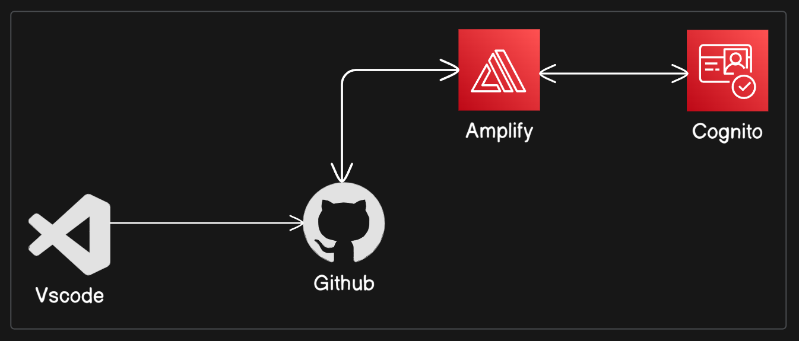

# AWS-cognito-React-Quiz-App

This repository includes a React quiz application configured to host with AWS amplify and AWS cognito.

AWS amplify used to host the quiz application's frontend and backend, AWS cognito uses to add the authentication part for React frontend.

##  Files

- **App.js**: React application configured with cognito authentication
- **Quiz.js**: The Quiz component
- **quizData.js**: The question for quiz

# Overview


## 1. Node modules installation - AWS amplify

```bash
  npm install -g @aws-amplify/cli
```
## 2. Configure amplify with local machine terminal

```bash
amplify configure
```

Follow below steps correctly configure amplify and secrets configurations using AWS console.

```bash
i.   Add a user to amplify```
ii.  attach amplify permission policies
iii. Create access key and secret access key for user
iv.  Configure local machine correctly with access secrets 
```

## 3. Create React app

use latest command to create the react application.

```bash
npx create-react-app@latest <react_app_name>
```

## 4. Change to react app's root
```bash
cd <react_app_name>
```

## 5. Local Amplify configurations with cognito and push to the cloud environment
```bash
i.  amplify init
ii. amplify add auth - configuring authentication based on email
iii.amplify push - pushing the backend authentication configurations to cloud backend  
```

## 6. Install amplify libraries for React 
```bash
npm install aws-amplify @aws-amplify/ui-react
```

## 7. Local check of React application
```bash
npm start
```

## 8. Deploy with CI/CD pipeline configured suing AWS console
```bash
i.  Host the frontend in Amplify using GitHub(AWS-cognito-React-Quiz-App repository).
ii. CI/CD deployment with amplify, when changes come up to code automatically completing the deployment to the hosted frontend.
```
